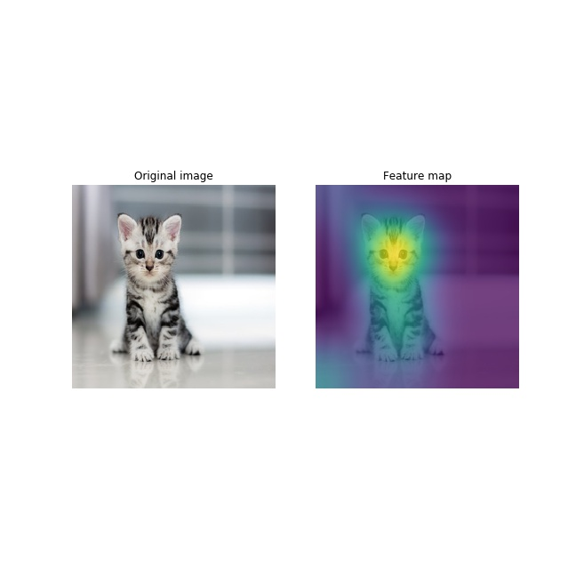

In this repo I am experimenting with feature visualization.
It includes reproducing the following paper: https://arxiv.org/pdf/1506.06579.pdf . 

  Morevoer, I played with highlighting feature maps, which is useful for detecting week
sides of the model, e.g. in detection or recognition.
 

